# 用户消费行为分析


## 功能特点

- 用户消费数据清洗与预处理
- 消费行为模式识别（如 RFM 分析）
- 用户分群（聚类分析）
- 可视化展示分析结果


## 项目结构

```
Behavior-analysis/
├── analysis/                
├── preprocessing/               
├── visualization/                
├── README.md  
├── main.py              
└── config.py     
```


## 可视化


 

 

 

 

 


 


 

 

 

 

 

 

 


## 可视化.2

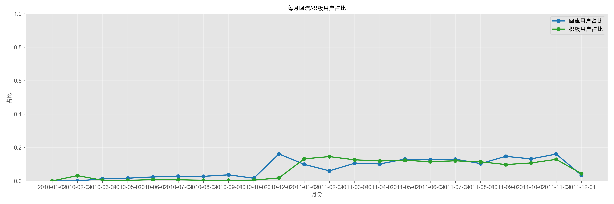  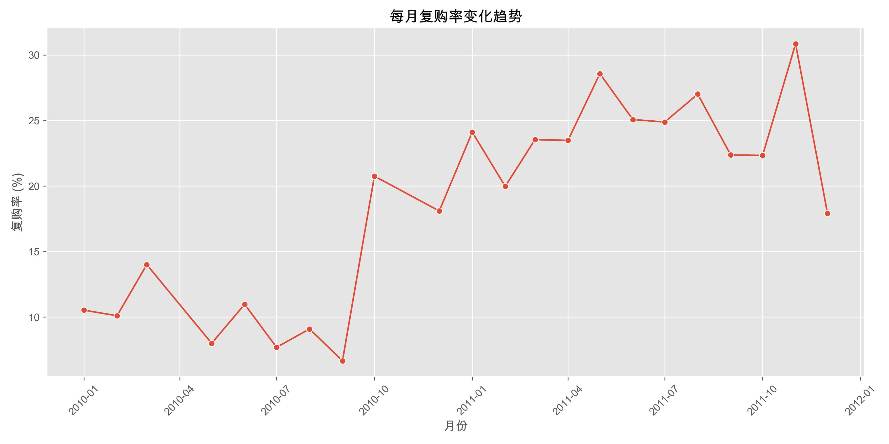 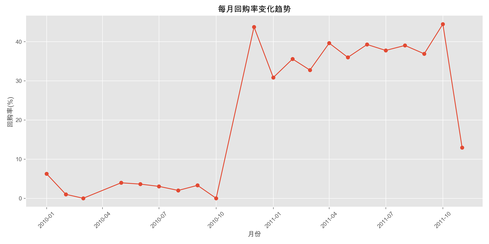  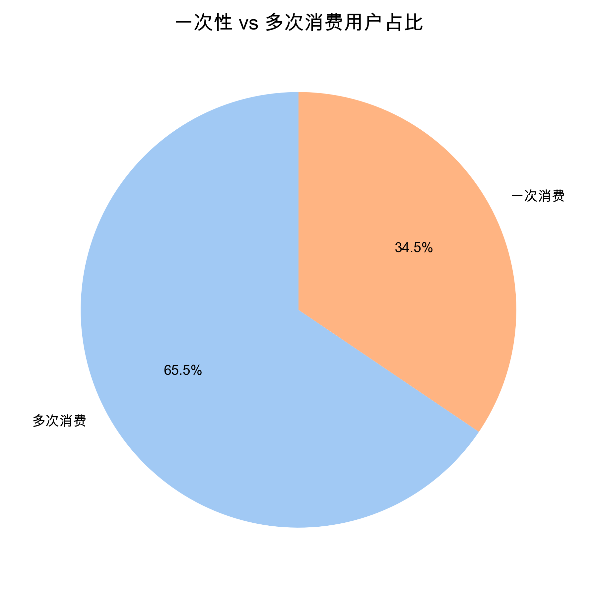 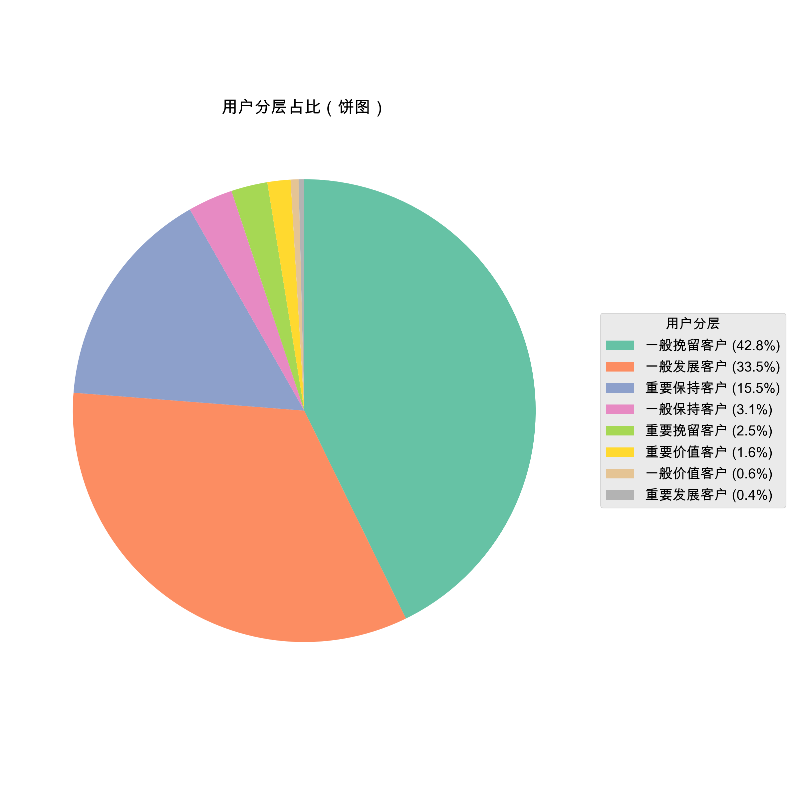   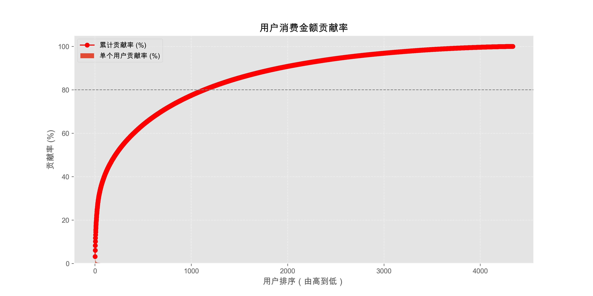 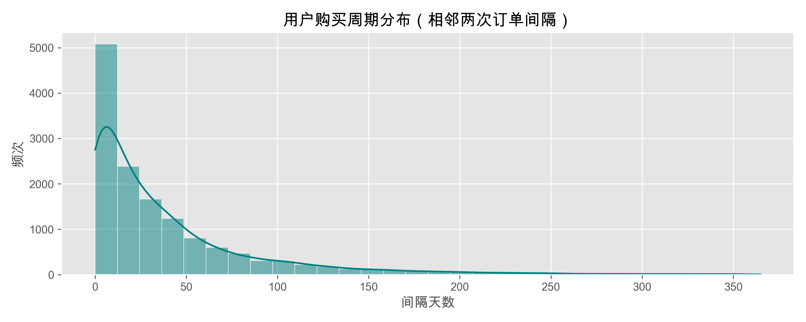 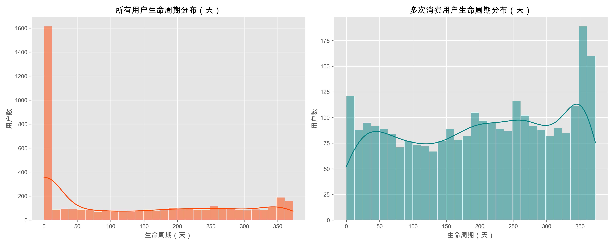 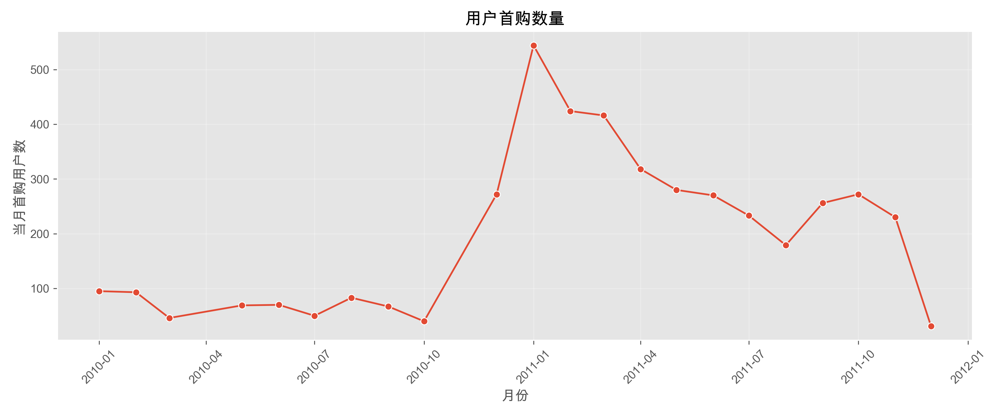 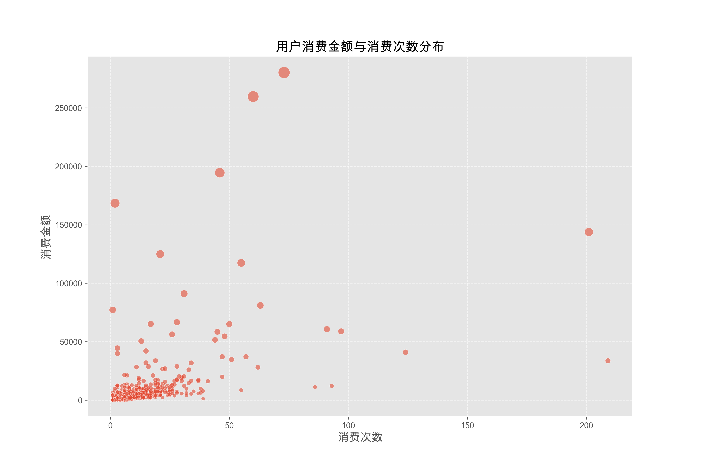 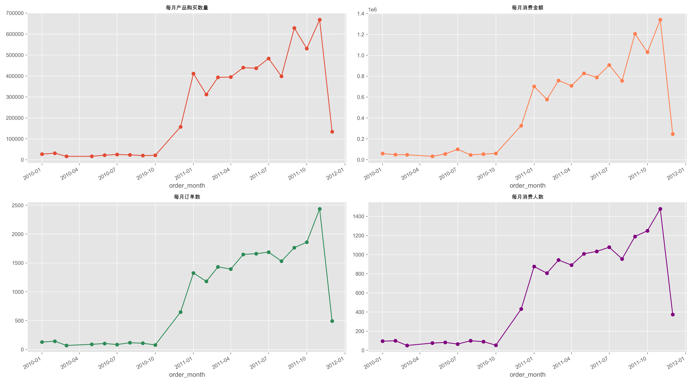 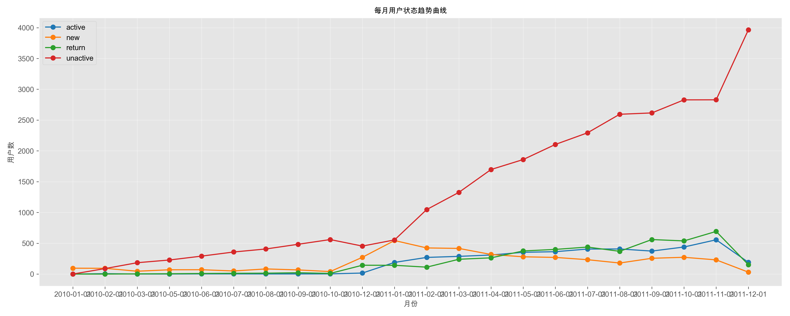 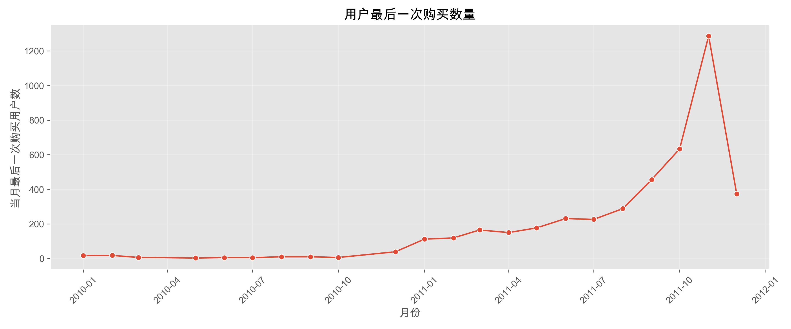
